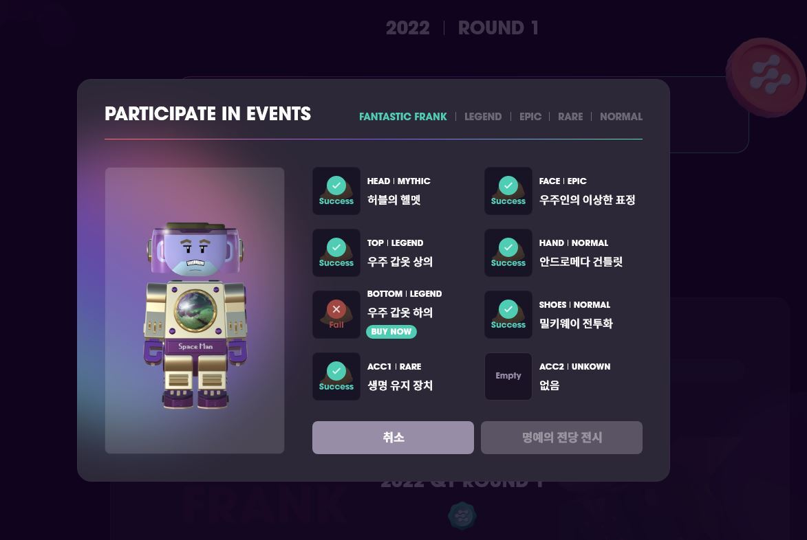

# Rony Club NFT

## Rony Box

Rony Box is an NFT that is revealed after 3 days after, Rony Boxes are minted every round.

\
\
_\*All NR tokens from the Rony Box sale will be burned._\
_\*For the first round of Rony Box, you can use the Rony Box you receive by participating in the NEURONswap launchpad in the same way as the Rony Box minted or purchased from the market._

## Parts NFT&#x20;

Parts NFT can be acquired from Rony Box minting or purchased at the marketplace. Parts NFT consists of 7 parts(top,bottom,gloves,mask,headㄷㅁ,shoes and accessories). There are rarity for each Parts NFTs and they can be used to decorate the avatar or snthesize NFTs.

## Synthesis

Parts NFTs can be synthesised to make one Synthesis NFT. \

## Synthesis NFT

Synthesis NFTs can be created by synthesizing certain parts NFTs. The synthesis NFT will be registered and shown in the Hall of Fame and will mine NR tokens for 90 days.

The total number of Synthesis NFTs per round is limited to 100. Each additional round adds 100 synthetic NFTs, and the total issuance is finally limited to 1,000. Rounds run approximately every two weeks.&#x20;

_\*Synthesis NFT cannot be disassembled back to Parts NFTs_

## Hall  of Fame

The Hall of Fame is a space where avatars of 100 people who have completed the round set look are displayed.\
\
There are 5 types of set looks for the 1st round of Rony Club: Frank Set, Legend Set, Epic Set, Rare Set, and Normal Set. Users who have all the parts NFTs required for a set have three choices.\
\

### **1. Exhibit in the Hall of Fame**

When you complete a round set look and decide to display it in the Hall of Fame, the parts NFT will be synthesized into a Synthesis NFT and displayed in the Hall of Fame. All rights of Synthesis NFT are held by the creator and from the moment the exhibition in the Hall of Fame is completed, NR mining will be started for 90 days. The avatars displayed in the Rony Club Hall of Fame are recorded in the history of the Rony Club, and special benefits for those may occur in the future.

### 2. Holding parts NFT

You can create your own avatar by wearing the parts NFT. You can participate in the Rony House Party event by combining various parts NFTs to form many rounds. In addition, you can complete the set look by using parts NFT in a later round.

### 3. Selling on the marketplace

You can earn money by selling parts NFTs on the marketplace.

_\*The following contents are written using the 1st round of Rony Club as an example._

### Frank Set

A set of combinations carefully selected by NEURON’s designer Frank, a set of 1 Mythic Item and multiple grade items. Only 3 out of 3,500 are Mythic Items, and the first person to complete the Frank Set and enter the Hall of Fame gets 90-day mining rights.

### Legend Set

The first 4 people who create a Synthesis NFT using 7 parts NFTs that are Legendary grades and register in the Hall of Fame get NR token mining rights for 90 days.

### Epic Set

The first 10 people who create a Synthesis NFT using 7 parts NFTs that are Epic grades and register in the Hall of Fame get NR token mining rights for 90 days.

### Rare Set

The first 30 people who create a Synthesis NFT using 7 parts NFTs that are Rare grades and register in the Hall of Fame get NR token mining rights for 90 days.

### **Normal Set**

The first 55 people who create a Synthesis NFT using 7 parts NFTs that are Normal grades and register in the Hall of Fame get NR token mining rights for 90 days.

_\*All NFTs can be traded on Pala square and Opensea._&#x20;

_\*In the case of selling Synthesis NFT without receiving the rewards distributed, the previously accumulated rewards will also be transferred to the buyer. The user bears all responsibility for any damage resulting from the sale without receipt of the Reward._

_\*Each set image will be displayed in advance on the web._&#x20;

_\*The number of avatars displayed in the Hall of Fame, the number of people, mining rights, and mining period may change each round depending on the concept ._

###
