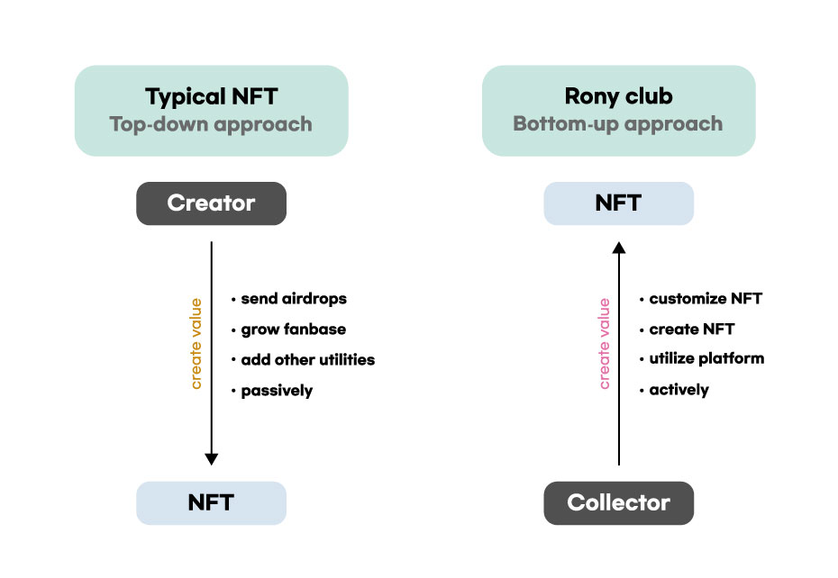

# Rony Club's Vision

## **NFT Paradigm Shift**

#### From Top-down to Bottom-up

Recently, professional creators such as illustrators and graphic artists, as well as the general public’s interest in NFT are increasing. While the demand for NFT minting is increasing, NFT production is expensive because it requires knowledge of smart contracts or can only be produced by developers who know how to handle smart contracts. As such, there are great hurdles in NFT production, so all existing NFT projects are operated in a top-down manner in which the project team creates the NFT and all users can do is purchase.

To solve this problem, Rony Club has planned a service that allows collaboration between users and projects, and allows all users to use their creative imaginations to create NFTs. The NFTs that can be produced in Rony Club are parts NFTs and synthetic NFTs and users can freely create their own NFTs. Since all users have all rights to the NFTs they create, they are free to create more creative NFTs. Rony Club is moving away from the top-down method that is characteristic of the current NFT market, and aims for a bottom-up method in which community decisions create value.

Rony Club provides users CIY(Create It Yourself) tool that allows users to create NFTs. The CIY tool is a tool that allows users to unique PFP works they want by arranging the image sources uploaded by the user based on an algorithm. The goal of Rony Club is to let users create and trade parts NFTs (tops, bottoms, hats, gloves, masks, accessories, etc.) and synthetic NFTs.

By using the CIY tool provided by Rony Club, users can directly become an NFT creator and make money. All users can create NFTs and sell their works through the marketplace. The copyright of all NFTs created belongs to the creator, and when the NFT is traded in the Rony Club NFT Market, the royalty is paid to the creator. NFTs created through the CIY tool can be traded in marketplaces such as Opensea and Rony Club Marketplace.

## **DEX-Linked Metaverse**

#### Rony House

Rony House(Metaverse) will be released in early August. Rony House is a 3D space where you can use NEURON DEX service, NFT games and various contents within the metaverse and participants can use functions such as token swap, deposit, and staking.\
\
In addition, we plan to introduce essential services to build a user-oriented decentralized Web 3 ecosystem such as multiplayer and chat functions. The NEURON team is developing more diverse services to create sustainable values.\
\
Please look forward to the 3D governance voting function that will be released in the future, and the NEURON team will strive to make it easy and fun for anyone to use the service through a reliable service.\

1\. Multiplayer

Anyone from all over the world can create an avatar that reflects their individuality and preferences in the Rony House(Metaverse) and provide a unique multiplayer experience.

Choose various types of skins and wallpapers, customize your avatar through minting participation by round and through the marketplace. Enjoy multiplayer with your “altnernate-self” as well as your favorite avatar.

2\. Chat function

Rony House supports the real-time chat function for compatibility with a digital content multi-platform that can use NFT games and various services within the metaverse.

## A metaverse with governance

**Rony Council**

In the council in the metaverse world, Ronys can propose autonomous proposals and agendas on protocol technology, governance rules. On the proposed agenda, Ronys can vote depending on their gNR holdings.

**Rony Financial Committee**

In the Financial Committee in the metaverse world, Ronys can voluntarily raise proposals and agendas for the protocol's economy.

Protocol economics include reward for traders, reward for governance token staking, pair boosting, marketing expense handling, bug bounties, and more. On the proposed agenda, Rony can vote depending on their gNR holdings.
