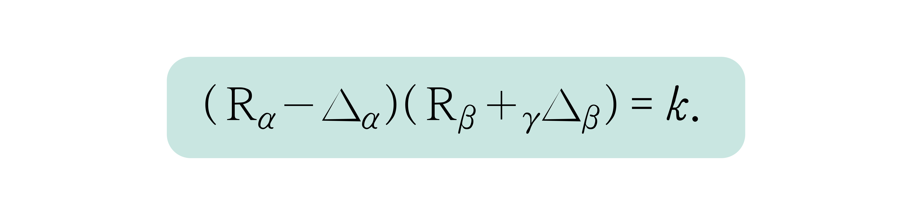
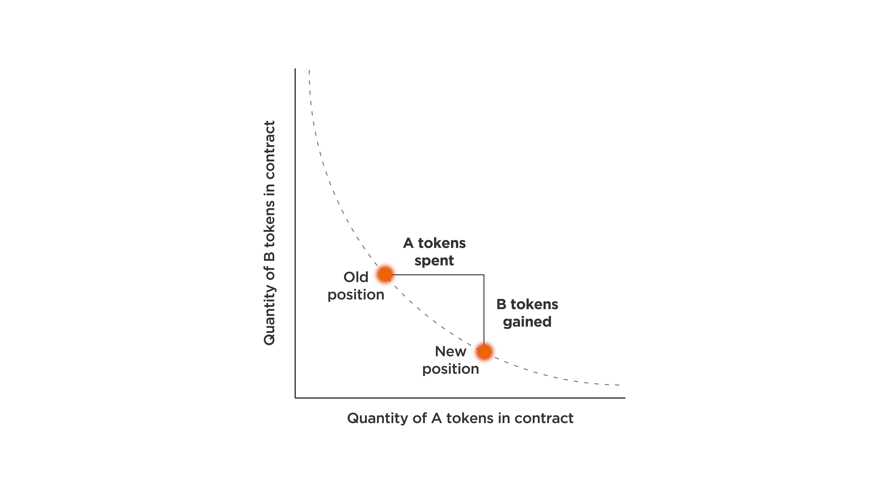

# Swap

In the crypto community, which considers decentralization as one of the most important values, there has been a constant debate about the contradiction of trading cryptocurrencies on centralized exchanges. Many DEXs were developed to solve this problem, but the early DEX products were developed in the order book method which is used in the centralized exchange system. Due to the slippage problem caused by the low liquidity, the environment for trading cryptocurrencies was not as good as centralized exchanges.

AMMs integrate and provide liquidity to traders according to an algorithm. NEURONswap is implemented using CPMMs (Constant Product Market Makers) that fall into the category of AMMs as smart contracts on a permissionless blockchain. The CPMM-based DEX trading method is DeFined as an x\*y = k function, and the function above represents when a transaction occurs. R stands for reserve (liquidity), and R\_a and R\_b are tokens of the liquidity pair. γ is the transaction fee, and changes in token quantity are added and decreased within each pool reserve to keep k constant. Since the product of the two token reserve quantities must always maintain a constant k, if the supply of x tokens increases, the supply of y tokens will inevitably decrease, and vice versa.

Due to the nature of the inverse graph, it converges to infinity at both ends, so theoretically, liquidity supply is infinite. Thus, traders can trade at any time.

## **Fee**

There is a 0.3% transaction fee when trading on NEURONswap.&#x20;

0.03% will be distributed to liquidity providers and the remaining 0.27% will be used for buybacks.

.png>)
