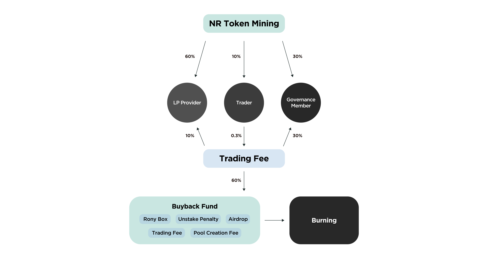

# Governance Token Staking

Staking is locking up NR tokens for a certain period of time(2 months to 2 years) by staking stakers can invest in the future of the NEURONswap Protocol, not the market value of the token. Investors can contribute to the stability of NEURONswap and become owners of NEURONswap through staking. Users can unstake the NR tokens whenever they want to.

_**“As a reward for staking NR tokens, stakers are given gNR tokens that represent their ownership of NEURONswap, and become a governance member of NEURONswap.”**_

## **Staking Example**

### ex) gNRs earned per NR staking period

* 2 months: 1 gNR
* 4 months: 2 gNR
* 8 months: 4 gNR
* 12months: 16 gNR
* 24months: 128 gNR

### ex) Unstake Penalty by Period

* ex) staking 100 NR for 2 months(60 days)
  * Unstaking after 7 days 7/60 = **11.66**% gNRs can be received
  * Unstaking after 30 days 30/60 = **50%** gNRs can be received
  * Unstaking after 60 days 60/60 = **100%** gNRs can be received

_\*Penalties due to unstaking will be all burned and excluded from circulation._\
_\*All responsibility for unstaking rests with the user, and the user must be clearly aware of this._

## What is gNR(governance NEURON)? 

gNR is the governance token of NEURONswap, which can be obtained through NR staking. As a member of the NEURON Protocol, the gNR staker shares NEURONswap’s mid- to long-term vision.

gNR tokens have different properties from regular tokens. While the value of the regular tokens is determined by the market , gNR is non-tradable but has special functions.

## **Functions of gNR**

* **Voting Rights**

gNR holders have the right to vote on governance issues of the NEURONswap. Members with greater governance power have stronger decision-making authority and can influence more on the direction and growth of th NEURON protocol. The Influence is determined by the gNR holdings.

* **Mining**

Governance members(stakers) will receive 30% of the community’s daily NR distribution as staking rewards depending on their stake. Distribution formula is calculated as follows: Mining volume= (Community Daily NR Distribution x 30%) x(peronal gNR holdings/ entire gNRs)

* **Protocol Revenue Sharing**

Governance members(stakers) will receive 30% of the transaction fee occurred in NEURONswap as staking rewards depending on their stake. Distribution formula is calculated as follows: Fee Revenue: (Total Transaction Fee of NEURONswap x 30%) x (peronal gNR holdings/ entire gNRs)

* **RONY CLUB titles**

In the RONY CLUB, where governance will be discussed, stakers will be given 5 titles (Diamond, Gold, Silver, Bronze, Stone) according to staking quantity and the staking period.

_**\*As NR staking opens, the community NR distribution and Transcation fee will change as follows.**_

_**Community NR Distribution**_

_LP Provider 60%, Trader 10%, Governance Member 30%_

_**Transcation Fee**_

_LP Provider 10%, Buyback 60%, Governance Member 30%_

## What does gNR mean to NEURONswap? 

gNR is the first key that enables the complete decentralization of NEURONswap. We aim to tokenize the ownership of the NEURONswap Protocol, distribute it to users, and ultimately create a fully decentralized protocol operated by DAO. In 2021, the Maker DAO was transformed into a completely community governed protocol. With gNR, NEURONswap will evolve step by step towards a community-friendly policy with the goal of NEURONswap DAO.

## Why is gNR so important? 

By participating in the project’s voting process, governance token holders can influence the protocol’s software implementations, updates, and technical improvements as opposed to in traditional companies, the CEO or board of directors makes management decisions. Protocol tokenization allows all users to own the protocol and achieve true democracy.

No gNR holders will be left behind or not heard. It’s not the developer’s responsibility to make difficult choices, so you can work with the community to identify issues, determine how to fix specific features, and also manage partnerships and funds.

## Why do we need gNR? 

* **Decentralization**

The most important aspect of crypto assets is decentralization. With gNR it is possible to incorporate them into concrete forms.

* **Everyone’s Participation**

NEURONswap forms a more evolved DAO, allowing users to actively participate in decisions about the path and direction of the project. We plan to provide an environment where more gNR holders can actively participate in governance through RONY CLUB.

* **User Collaboration**

Promote collaboration with free discussion and suggestions. Users are motivated to collaborate with other community members and reach conclusions in discussions because they have the option to vote on issues.

## Vision of gNR 

NEURONswap takes the first step towards a complete decentralization by introducing gNR. gNR will allow shareholders to make decisions on their own, from small decisions such as distributing NR tokens to major decisions such as setting the NEURONswap Protocol’s technology agenda and roadmap. Through free consultation among users, NEURONswap Protocol will expand the ecosystem together with shareholders and partners.

