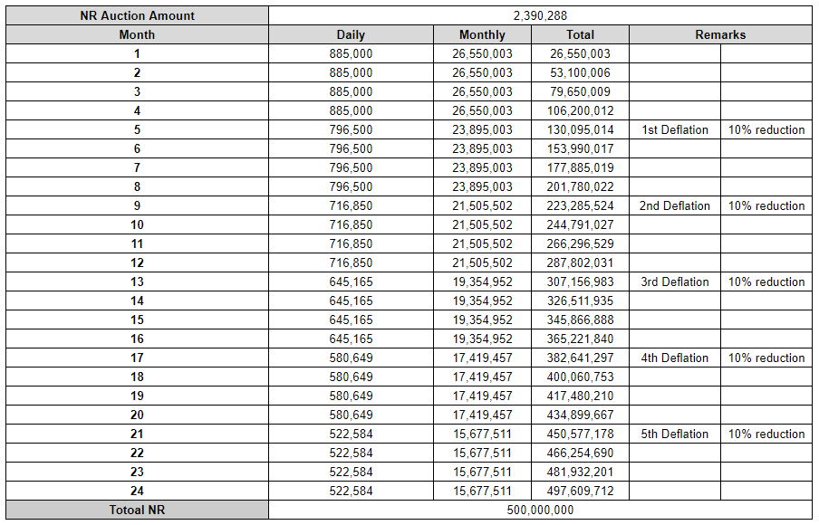

# Tokenomics

## NR(NEURON)

* **Ticker : NR**
* **Contract address** :[https://scope.klaytn.com/token/0x340073962a8561cb9e0c271aab7e182d5f5af5c8?tabId=tokenTransfer](https://scope.klaytn.com/token/0x340073962a8561cb9e0c271aab7e182d5f5af5c8?tabId=tokenTransfer)
* **Chain : Klaytn (Cypress)**

## Token Allocation

* **Total Supply : 500,000,000 NR**
* **Initial Starting Supply : 2,390,288 NR**
* **Daily NR Mining Volume : 885,000 NR**

\*_The total issuance period of NR tokens is 2 years._

_\*Before all tokens are minted after 2 years, a governance vote is held to decide whether to issue additional governance tokens._

_\*Before the issuance of a total of 500 million tokens for 2 years is completed, the number of additional issuance, period, and distribution are decided by governance voting._

_\*NR tokens have a total of 5 deflationary periods every 4 Months. Deflation is designed to reduce the issuance volume by 10% compared to the existing issuance volume to prevent rapid deflation._

## Token Distribution

* Community**:** 75.13%
  * Protocol Contributor (LP Provider + Staker) : 53.33%
  * Transaction Fee Payback Pool: 5.33%
  * Treasury: 16.47%&#x20;
* Team: 19.43% _(Team quantities are staked for 2 years.)_
* Advisor: 4.96%
* Initial Supply: 0.48%

.jpg>)

### Protocol Contributor

Liquidity providers create a trading environment in the DEX ecosystem. Liquidity providers are allocated 60% and stakers are allocated 30% of the daily NR mining for protocol contributor.

### **Trader**

Traders are allocated 10% of the daily NR mining for protocol contributor.

### Governance Member

Governance Token Stakers share the mid- to long-term vision of NEURONswap. Stakers are allocated 60% of the daily NR mining for protocol contributor.

## **Deflation Model**

NEURONswap has different buyback systems as the protocol grows. The systems are designed as a virtuous cycle ecosystem that encourages liquidity providers and traders to participate more in the ecosystem by continuously increasing the value of the NR token.

* Burn 90% of Transaction Fee(NR Token)
* Burn NR tokens used to create liquidity pool
* Burn NR tokens from Rony Box sale
* Burn a portion of NFT Market fee
* Burn airdrop NR tokens
* Burn NR token caused by unstake penalty
* 5 Deflations throughout the distribution
