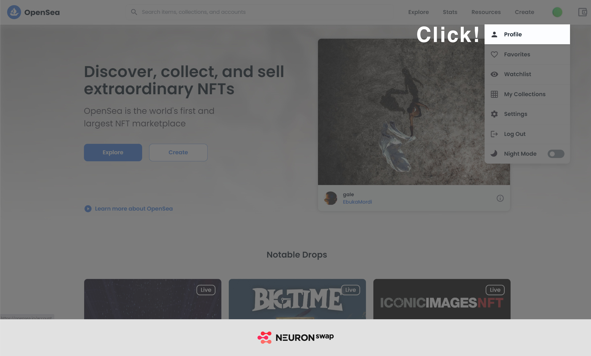
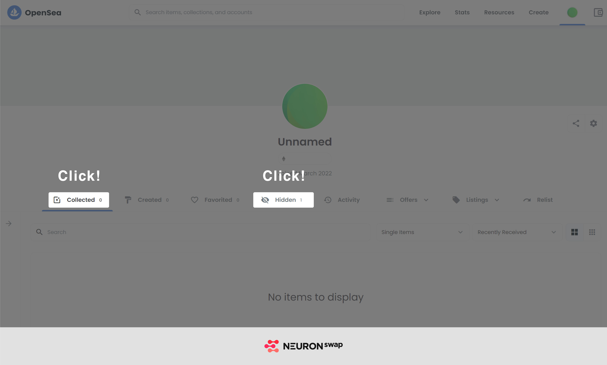
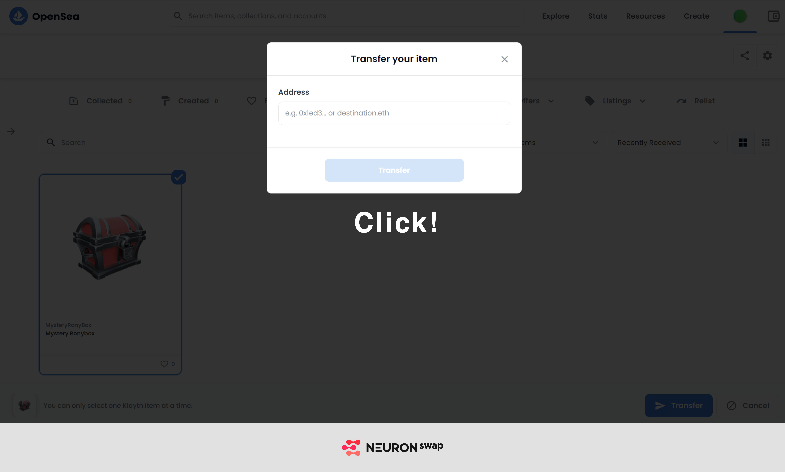

# Kaikas 지갑 유저

* **크롬 브라우저** 상에서 **Kaikas 지갑 설치**를 완료해주세요.

&#x20;    \* Kaikas(웹) 다운로드 링크 ([https://bit.ly/3dzmTqj](https://bit.ly/3dzmTqj))

* [https://opensea.io/](https://opensea.io) 우측 상단 “Connect your Wallet” 클릭 후 \[Kaikas 지갑 연결] 버튼을 클릭합니다.
* 서비스 연결 요청 창에서 Opensea에 대한 연결을 허용합니다.

.jpg>)

.jpg>)

* 연결된 지갑의 프로필로 접속합니다.

* \[Collected] 또는 \[Hidden] 에 이동할 NFT를 확인 후 \[More options]를 선택합니다.

.jpg>)

* \[Transfer] 선택 후 이동할 지갑주소를 입력합니다.

.jpg>)

.jpg>)

