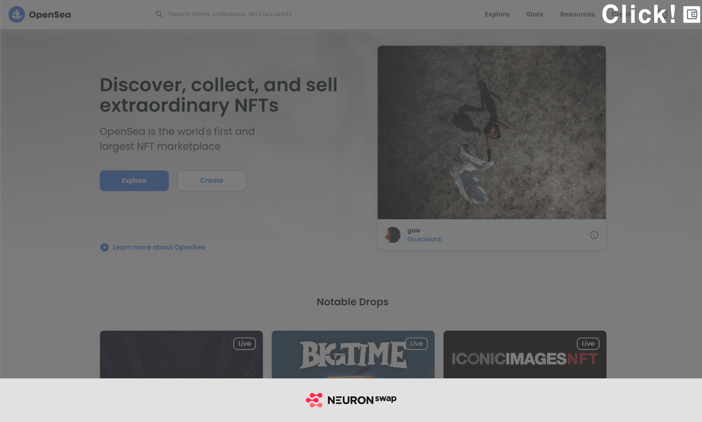

# Klip 지갑 유저

* Klip 지갑 유저의 NFT를 이동하기 위해 블루웨일 프로토콜에 접속합니다. ([https://app.bluewhale-protocol.com/](https://app.bluewhale-protocol.com))
* 우측 상단 “지갑 연결” 클릭 후 \[카카오 Klip 지갑 연결] 버튼을 클릭합니다.

* 카카오톡 앱을 실행하여 화면에 표시된 QR 코드를 스캔합니다.
* QR 코드 스캔 시 자동으로 클립 지갑이 실행됩니다. \[다음] 버튼을 클릭하여 블루웨일 프로토콜 서비스에 연결을 완료합니다.

* \[ASSIST ANT] 카테고리 내 \[토큰/NFT 보내기]로 이동합니다.

.jpg>)

* 주소로 NFT 추가 클릭 후 로니클럽 컨트랙트 주소를 입력합니다.

.jpg>)

* 보유한 NFT ID와 수량을 확인 한 뒤 Transfer 선택 후 이동할 지갑주소를 입력합니다.

.jpg>)
