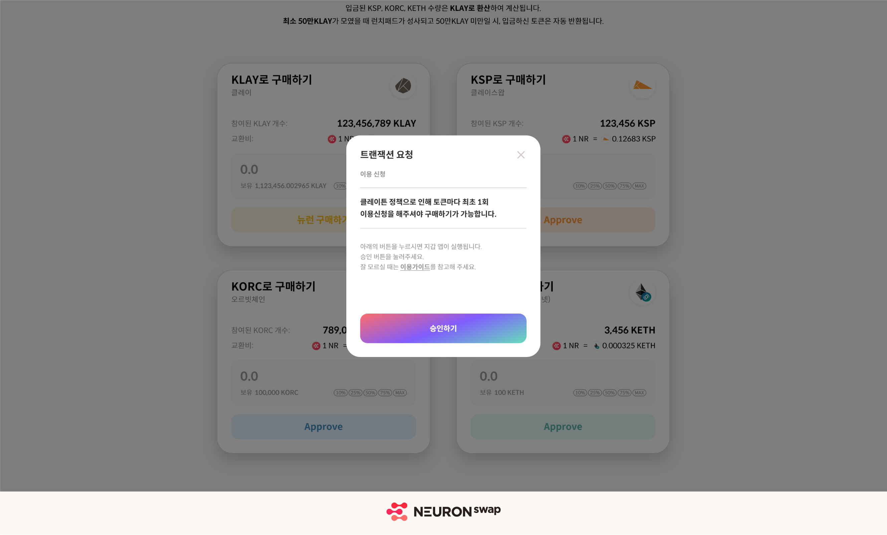

# 런치패드 참여

\- 일시 : 2021년 12월 13일 19시 \~ 12월 14일 18시59분59초 (한국 표준시 기준)

&#x20;  \*24시간의 한정된 시간으로 진행됨을 알려드립니다.

\- 캡 : 2,390,288 NR (총 발행량의 0.47%)

\- 참여 가능 토큰 : KLAY, KETH, KSP, KORC

\- 최소 500,000 KLAY가 모였을 때 런치패드가 성사됩니다.    &#x20;

\- 500,000 KLAY 미만일 시, 입금하신 토큰은 자동으로 반환됩니다.  &#x20;

*   NEURONswap([https://launchpad.neuronswap.com](https://launchpad.neuronswap.com))에 접속 후, 지갑연결 뒤  뉴런구매 버튼을 클릭합니다.

    _\*최초 지갑연결시  '승인하기 ' 절차가 필요합니다 ._

&#x20;     _\*지갑연결 방법은 '유저가이드 -지갑연결 '을 참고 하십시오 ._      &#x20;

* NR토큰은 KLAY, KSP, KORC, KETH로 구매가 가능하며 입금된 KSP, KORC, KETH 수량은 KLAY로 환산되어 계산됩니다.

* 수령하게 될 NR토큰의 예상 수량은 런치패드 종료시점의 NR토큰 최종 교환비와 입금한 토큰 수량에 따라 변동 됩니다.

* 12월 27일 19시부터 NR토큰 수령이 가능하며, 락업된 수량 중 20%는 초기에 락업 해제가 됩니다. 나머지 80%의 수량은 출시 후 90일동안 매 블록마다 일정한 양의 토큰이 선형으로 락업해제 됩니다.

