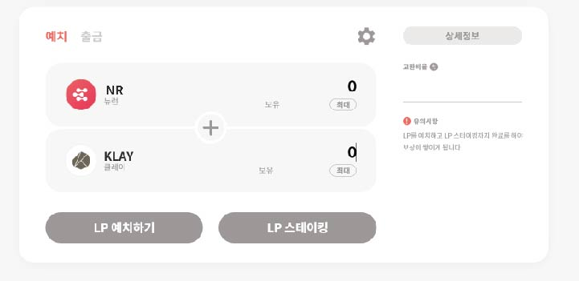

# 유동성풀 예치 / 출금

## 유동성풀 예치 / 출금

* NEURONswap에 접속 후, 페이지 상단 예치 버튼을 클릭합니다.
* 예치 가능 목록에서 원하는 유동성 풀을 선택합니다.
* 선택한 풀에서 한쪽 자산 수량을 입력하면, 함께 예치하기 위해 필요한 반대쪽 자산 수량이 자동으로 계산되어 입력됩니다.

### 예치

* LP 예치하기를 클릭 후 트랜잭션을 요청을 완료합니다.

 

* LP를 예치하고 LP 스테이킹까지 완료를 해야 보상이 쌓이게 됩니다.

.jpg>)

### 출금

* 출금을 원하는 LP수량을 입력하고 LP 언스테이킹 버튼을 클릭 후 트랜잭션 요청을 완료합니다.

 

* LP를 언스테이킹하고 LP 출금까지 완료를 해야 예치한 토큰을 내 자산에서 확인할 수 있습니다.

 
