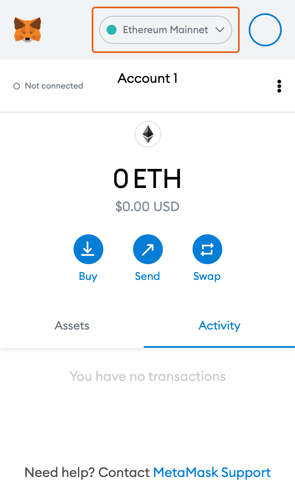
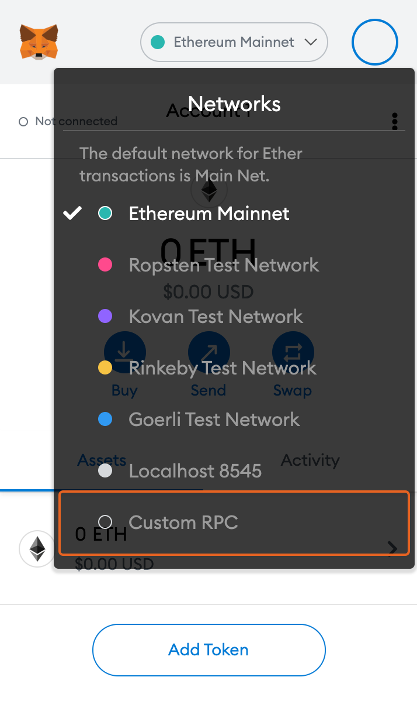

# Meta Mask (웹/모바일)

* 크롬 브라우저, 모바일에서 Metamask를 설치를 완료해주세요
* Metamask를 실행 후, 네트워크 설정 메뉴에서 “Custom RPC” 버튼을 클릭합니다.

* 아래 네트워크 정보를 입력 합니다.
  * Network Name: Klaytn Cypress
  * New RPC URL: (Default: [http://localhost:8551](http://localhost:8551))
  * Chain ID : 8217
  * Currency Symbol (optional) : KLAY
  * Block Explorer URL (optional) : https://scope.klaytn.com
* “Save” 버튼을 클릭합니다.
