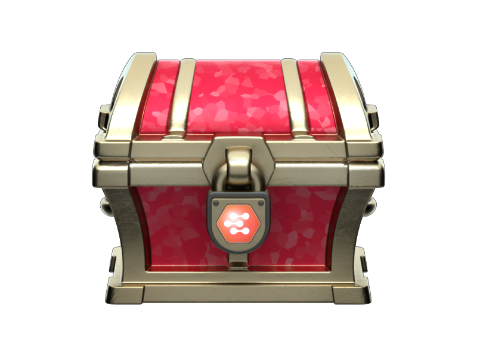
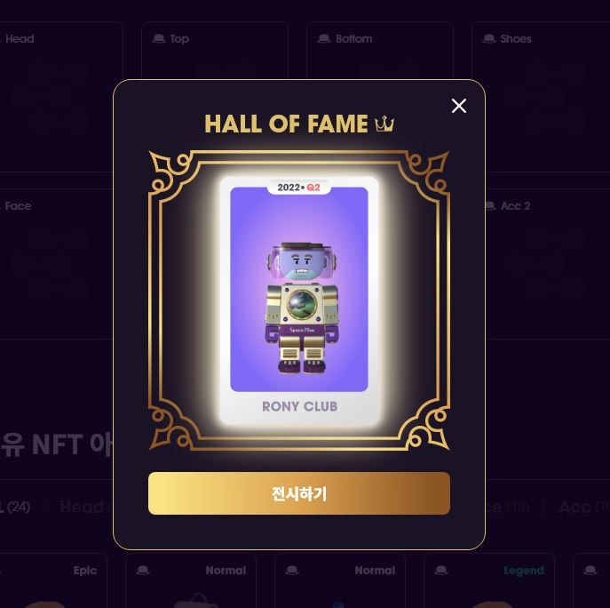

# 로니클럽 NFT

## **로니박스**&#x20;

로니박스는 로니클럽에서 민팅이 가능한 NFT로 라운드 마다 일정 수량의 로니박스 민팅이 가능합니다.&#x20;

_\*로니박스 판매를 통해 모이는 NR 토큰은 100% 소각됩니다._

## **파츠 NFT**&#x20;

로니박스 민팅과 마켓플레이스 구매를 통해 파츠 NFT를 획득할 수 있습니다. 파츠 NFT는 부위별 7가지 파츠(상의, 하의, 장갑, 페이스, 모자, 신발, 액세서리)가 존재합니다. 파츠 NFT에는 등급이 존재하며, 아바타를 꾸미거나 합성 NFT를 만드는데 사용할 수 있습니다.&#x20;

## 합성&#x20;

.JPG>)

파츠 NFT들은 합성을 통해 1장의 합성 NFT로 발행되며, 합성 NFT는 명예의 전당에 전시됩니다.

## **합성 NFT(Synthesis NFT)**&#x20;

합성 NFT는 특정 파츠 NFT를 합성하여 생성할 수 있는 NFT입니다. NFT는 명예의 전당에 전시됩니다. 명예의 전당에 등록된 합성 NFT는 채굴 기능을 가지며, 90일간 NR토큰이 채굴됩니다.

_\*합성 NFT는 파츠 NFT로 분해가 불가능합니다._&#x20;

## **명예의 전당**

명예의 전당은 라운드별 발행되는 다양한 세트룩을 완성한 유저의 아바타가 전시되는 공간입니다. 로니클럽 활성화에 기여한 유저를 선정하여 이들의 합성 NFT를 명예의 전당에 전시합니다. 명예의 전당에 전시된 아바타는 NR 토큰 채굴 혜택을 부여받습니다.

로니클럽 라운드는 프랭크 세트, 레전드 세트, 에픽 세트, 레어 세트, 노말 세트로 5종류의 세트룩이 존재합니다. 세트에 필요한 모든 파츠 NFT를 가진 유저는 다양한 선택을 할 수 있습니다.

### **1. 명예의 전당에 전시**

라운드 세트를 완성하고 명예의 전당에 전시하기로 결정하면, 파츠NFT가 합성 NFT로 합성되고 명예의 전당에 전시됩니다. 명예의 전당에 전시가 되더라도 합성 NFT 소유권은 개인이 가지며, 90일간 NR 채굴이 진행됩니다. 로니클럽 명예의 전당에 전시된 아바타는 로니클럽의 역사에 기록되고 추후 특별한 혜택이 생길 수 있습니다.

### **2. 파츠 NFT 로니박스 교환**

이 전 라운드에 민팅된 파츠 NFT를 로니박스로 교환할 수 있습니다. 박스 교환은 라운드 시작 전 교환이 진행되며 파츠 NFT는 라운드별 최대 200개의 로니박스로 교환이 가능합니다.

### **3.** 이벤트 활용

로니 하우스파티는 참여자들이 라운드마다 발행된 다양한 파츠 NFT를 자신의 아바타에 조합해 자신만의 개성있는 아바타를 뽐낼 수 있는 콘텐츠 입니다. 라운드별로 발행 될 다양한 파츠 NFT를 조합해 로니 하우스파티에 참여할 수 있습니다.

### 4. 마켓플레이스에 판매

파츠 NFT를 마켓플레이스에 판매하여, 수익을 얻을 수 있습니다.

****

_\*하기 내용은 로니클럽 1라운드를 예시로 작성된 내용입니다._

### **프랭크 세트**&#x20;

뉴런 디자이너 프랭크가 엄선한 조합의 세트로 Mythic Item과 여러 등급의 아이템이 섞인 세트입니다. 프랭크 세트를 완성하고 명예의 전당에 등록한 최초 1인은 90일 채굴 혜택을 얻습니다.

### **레전드 세트**&#x20;

파츠 NFT 레전더리 등급 7개를 합성해서 합성 NFT를 만들고 명예의 전당에 등록한 최초 4인은 90일간 NR토큰 채굴 혜택을 얻습니다.

### **에픽 세트**&#x20;

파츠 NFT 에픽 등급 7개를 합성해서 합성 NFT를 만들고 명예의 전당에 등록한 최초 13인은 90일간 NR토큰 채굴 혜택을 얻습니다.

### **레어 세트**&#x20;

파츠 NFT 레어 등급 7개를 합성해서 합성 NFT를 만들고 명예의 전당에 등록한 최초 40인은 90일간 NR토큰 채굴 혜택을 얻습니다.

### **노멀 세트**&#x20;

파츠 NFT 노멀 등급 7개를 합성해서 합성 NFT를 만들고 명예의 전당에 등록한 최초 92인은 90일간 NR토큰 채굴 혜택을 얻습니다.

_\*로니클럽의 모든 NFT는 Pala square, Opensea에서 거래가 가능합니다._

_\*합성 NFT에 분배된 리워드를 수령하지 않고 판매 시 기존에 쌓인 리워드도 구매자에게 양도됩니다. 리워드를 수령하지 않고 판매하여 발생하는 생기는 피해에 대한 모든 책임은 사용자에게 있습니다._

_\*각 세트 이미지는 Web을 통해 사전 확인이 가능합니다._

_\* 명예의 전당에 기록되는 아바타는 라운드별 컨셉에 따라 인원 및 채굴에 대한 권한, 기간이 변동될 수 있습니다._

__

