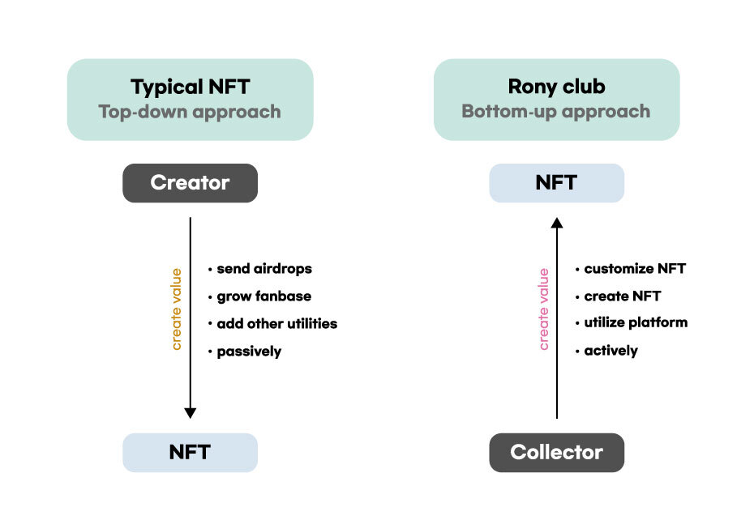

# 로니 NFT

### 1. **NFT Paradigm shift**

## **NFT Paradigm shift**

**From Top-down to Bottom-up**

****

최근 일러스트레이터, 그래픽 아티스트와 같은 전문 크리에이터들은 물론 일반인들의 NFT에 대한 관심이 증가하고 있습니다. NFT 민팅에 대한 수요가 증가하는데 반해, NFT 제작은 스마트 컨트랙트에 대한 지식이 요구되거나, 스마트 컨트랙트을 다룰 줄 아는 개발자를 통해 제작이 가능하기 때문에 많은 비용이 요구됩니다.&#x20;

이처럼, NFT 제작에 큰 허들이 존재하기 때문에, 현존하는 모든 NFT 프로젝트는 프로젝트 팀이 NFT를 제작하고 유저들은 구매만 가능한 Top-Down 방식으로 운영되고 있습니다.&#x20;

로니클럽은 이러한 문제를 해결하고자 유저가 참여하는 서비스를 기획하였습니다. 로니클럽은 현 NFT 시장의 특징인, Top-Down 방식에서 벗어나 커뮤니티의 결정이 가치를 창출하는 Bottom-Up 방식을 지향합니다.

로니클럽 NFT 서비스는 로드맵에 따라 진화해 갈 것 입니다.

Step 1. 로니클럽 출시 : 팀 선정 NFT

팀에서 선정하는 합성 NFT로 민팅이 진행됩니다. 선정된 NFT를 합성할 시 명예의 전당에 전시되며, 로니클럽의 역사에 기록되고 소정의 혜택을 받습니다.

Step 2. 로니 하우스파티 출시 : 유저 선정 NFT

로니 하우스파티는 참여자들이 라운드마다 발행된 다양한 파츠 NFT를 자신의 아바타에 조합해 자신만의 개성 있는 아바타를 뽐낼 수 있는 서비스입니다. 참여자는 포토존에 자신만의 NFT를 등록하고 로니클럽 멤버들의 투표를 통해 베스트 드레서가 선정됩니다. 베스트 드레서의 아바타 모습 그대로 1장의 카드형 NFT가 민팅됩니다. 베스트 드레서 순위에 따라, 하우스 파티 참여 혜택을 부여받습니다. 로니클럽 NFT 마켓 로니클럽 NFT 마켓 유저가 제작한 NFT는 Opensea와 로니클럽 NFT 마켓에서 자유롭게 거래됩니다. 로니클럽 NFT 마켓은 기본적으로 거래수수료로 Klay가 사용되지만, NR 토큰으로 거래할 경우 더 저렴한 수수료로 거래가 가능합니다. 로니클럽 NFT 마켓에서 발생하는 수수료는 NR 토큰 소각과 gNR 홀더 보상 분배에 사용됩니다**.**

****

#### &#x20; From Top-down to Bottom-up

#### &#x20; 유저 창작 및 소득창출

* 최근 일러스트레이터, 그래픽 아티스트와 같은 전문 크리에이터들은 물론 일반인들의 NFT에 대한 관심이 증가하고 있습니다. NFT 민팅에 대한 수요가 증가하는데 반해,  NFT 제작은 스마트 컨트랙트에 대한 지식이 요구되거나, 스마트 컨트랙트을 다룰 줄 아는 개발자를 통해 제작이 가능하기 때문에 많은 비용이 요구됩니다. 이처럼, NFT 제작에 큰 허들이 존재하기 때문에, 현존하는 모든 NFT 프로젝트는 프로젝트 팀이 NFT를 제작하고 유저들은 구매만 가능한 Top-Down 방식으로 운영되고 있습니다.

* 로니클럽은 이러한 문제를 해결하고자 유저가 참여하는 서비스를 기획하였습니다. 로니클럽은 현 NFT 시장의 특징인, Top-Down 방식에서 벗어나 커뮤니티의 결정이 가치를 창출하는 Bottom-Up 방식을 지향합니다.

### 2. **로니클**

#### 로니클럽 NFT 서비스는 로드맵에 따라 진화해 갈 것 입니다.

#### Step 1. 로니클럽 출시 : 팀 선정 NFT

팀에서 선정하는 합성 NFT로 민팅이 진행됩니다. 선정된 NFT를 합성할 시 명예의 전당에 전시되며, 로니클럽의 역사에 기록되고 소정의 혜택을 받습니다.

#### Step 2. 로니 하우스파티 출시 : 유저 선정 NFT

로니 하우스파티는 참여자들이 라운드마다 발행된 다양한 파츠 NFT를 자신의 아바타에 조합해 자신만의 개성 있는 아바타를 뽐낼 수 있는 서비스입니다. 참여자는 포토존에 자신만의 NFT를 등록하고 로니클럽 멤버들의 투표를 통해 베스트 드레서가 선정됩니다. 베스트 드레서의 아바타 모습 그대로 1장의 카드형 NFT가 민팅됩니다. 베스트 드레서 순위에 따라, 하우스 파티 참여 혜택을 부여받습니다.

### 3. **로니클럽 NFT 마**

* 유저가 제작한 NFT는 Opensea와 로니클럽 NFT 마켓에서 자유롭게 거래됩니다. 로니클럽 NFT 마켓은 기본적으로 거래수수료로 Klay가 사용되지만, NR 토큰으로 거래할 경우 더 저렴한 수수료로 거래가 가능합니다. 로니클럽 NFT 마켓에서 발생하는 수수료는 NR 토큰 소각과 gNR 홀더 보상 분배에 사용됩니다
