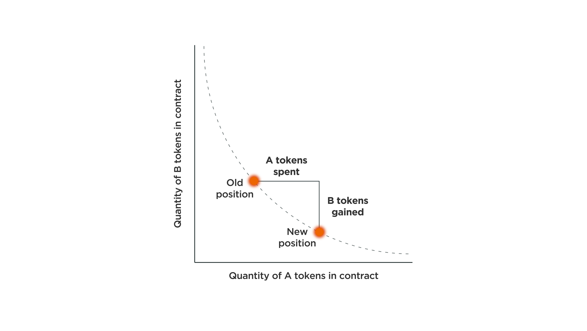

# 스왑

탈중앙화를 중요한 가치로 생각하는 크립토 커뮤니티에서는 중앙화 거래소에서 암호화폐를 거래하는 모순에 대해 꾸준한 논란이 있어왔습니다. 이 문제를 해결하기 위해 많은 DEX들이 개발되었지만 초기 DEX 제품들은 중앙화 거래소 시스템에서 사용하는 오더북 방식으로 개발되었기에 적은 유동성으로 인한 슬리피지(Slippage) 문제로 중앙화 거래소만큼 암호화폐를 거래하기에 적절한 환경이 아니었습니다.

AMMs은 거래자에게 알고리즘에 따라 유동성을 통합·제공하는 에이젼트입니다. NEURONswap은 무허가형 블록체인에서 스마트컨트랙트로 AMMs의 범주에 속하는 CPMMs(Constant Product Market Makers)을 이용하여 구현되었습니다. CPMM 기반의 DEX 거래 방식은 x\*y = k 함수로 정의되며 위 함수는 거래가 발생 때의 함수를 나타낸 것입니다. 여기서 R은 리저브(유동성)를 의미하며 R\_a와 R\_b는 유동성 페어의 토큰들입니다. γ는 트랜잭션 수수료이며 상수인 k를 유지하기 위해 각 풀 리저브 내에서 토큰 수량의 변화가 더해지고 감소합니다. 두 토큰 리저브 수량의 곱이 항상 일정한 k를 유지해야 하기 때문에, x 토큰의 공급량이 늘어나면 y 토큰의 공급은 줄어들 수밖에 없고 반대의 경우도 마찬가지입니다.

반비례 그래프 특성상 양쪽 끝으로 무한으로 수렴하기에 이론적으로 무한대의 유동성(Infinite Liquidity)을 공급할 수 있습니다. 따라서, 풀 내에 유동성만 있다면 거래자는 언제라도 거래를 할 수 있습니다.

## **수수료**

뉴런스왑 서비스 이용시, 거래량의 0.03%의 거래수수료가 발생합니다. 뉴런스왑은 거래수수료의 10%를 NR토큰으로 페이백합니다.&#x20;

