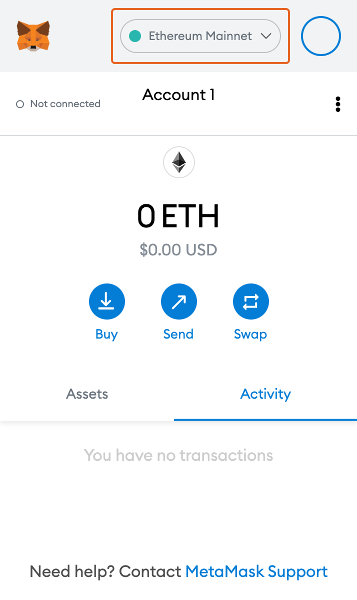

# Meta MASK (WEB/Mobile)

* Please complete the installation of Metamask on your Chrome browser or mobile.
* After running Metamask, click the “Custom RPC” button in the network settings menu.

* Enter your network information below.
  * Network Name: Klaytn Mainnet Cypress
  * New RPC URL: https://kaikas.cypress.klaytn.net:8651
  * Chain ID : 8217
  * Currency Symbol (optional) : KLAY
  * Block Explorer URL (optional) : https://scope.klaytn.com
* Click the “Save” button.
* Convert Ethereum (ETH) to KEthereum (KETH) at Orbit Bridge [(https://bridge.orbitchain.io/](https://bridge.orbitchain.io)).&#x20;
* For detailed instructions on how to use the Orbit Bridge, refer to the Orbit Bridge User Guide ([https://bridge.orbitchain.io/assets/orbitbridge\_guide\_en.pdf](https://bridge.orbitchain.io/assets/orbitbridge\_guide\_en.pdf)).
