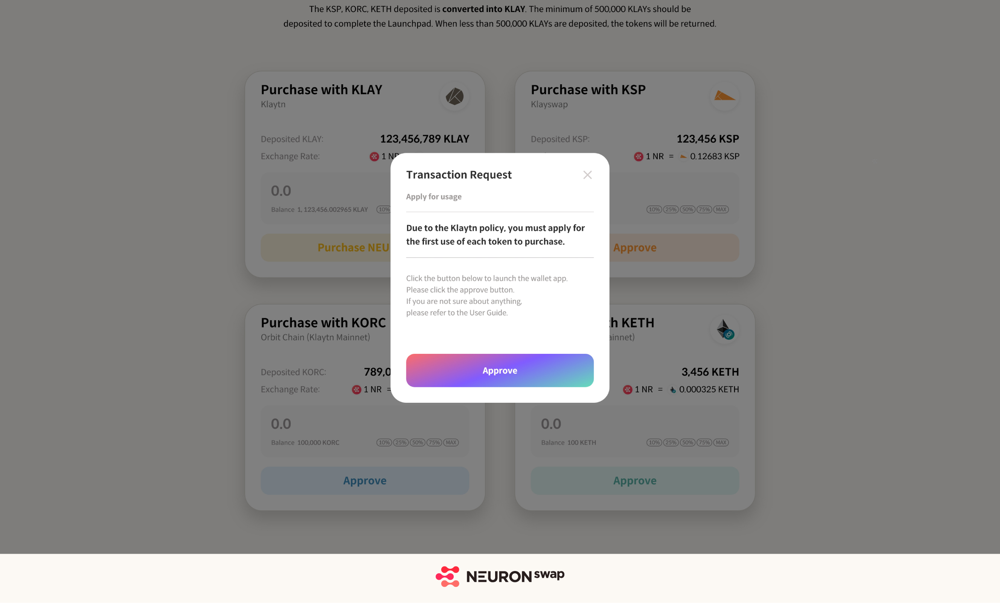

# Launchpad

\- Date: 2021.12.13 (Mon) 10:00 A.M – 12.14(Tue) 09:59:59 A.M (UTC )

&#x20; \*Please note that launchpad will be held for a limited time(24

\- Tokens Quantity Offered: 2,390,288 NR (0.47% of Total Issuance)

\- Tokens that can participate in: KLAY, KETH, KSP, KORC

\- The minimum of 500,000 KLAYs should be deposited to complete the Launchpad.

\- When less than 500,000 KLAYs are deposited, the tokens will be returned.

* Go to NEURONswap Launchpad page(https://launchpad.neuronswap.com/purchase) and click ‘Purchase NR’

&#x20;     _\*_ For the first time, the "approve" procedure is required when connecting the wallet.

&#x20;     _\*_ Refer to "User Guide-Connect to Wallet" for how to connect your wallet.

* NR tokens can be purchased by KLAY, KSP, KORC, KETH and deposited KSP, KORC, KETH quantities will be converted to KLAY.

* 20% of locked up tokens can be received immediately when the Launchpad ends at 19:00 P.M. December 27th. The 80% will be unlocked for every block for 90 days after official launch.

* The expected amount of NR tokens you will receive will depend on the exchange rate of NR tokens at the end of the Launchpad and the amount of tokens deposited.

