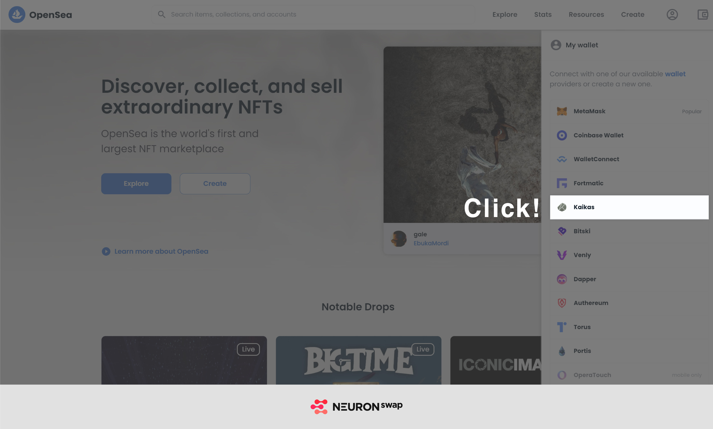
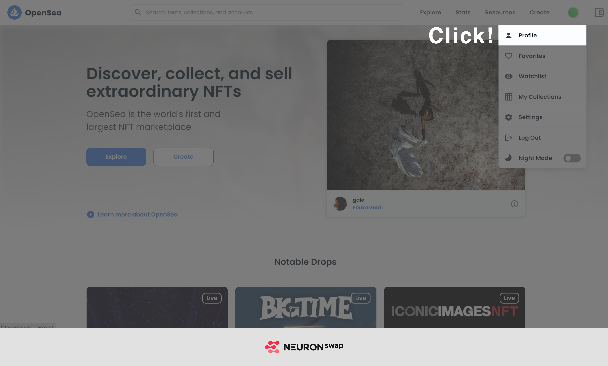
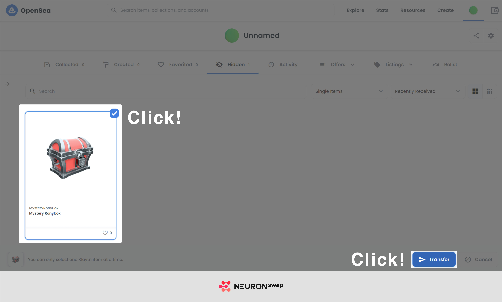

# Kaikas Wallet User

* Please install the Kaikas wallet **on the Chrome browser**.

&#x20;    \* Kaikas(WEB) Download link ([https://bit.ly/3dzmTqj](https://bit.ly/3dzmTqj))

* Go to OpenSea ([https://opensea.io/](https://opensea.io)) and click \[Connect Your Wallet] on the top right corner and click \[Kaikas]
* Approve Opensea for connection

* Go to \[Profile]

* Check the NFT in \[Collected] or \[Hidden] tab and click \[More Options]

* Click \[Transfer] and insert the wallet address you would like to send your NFTs to

